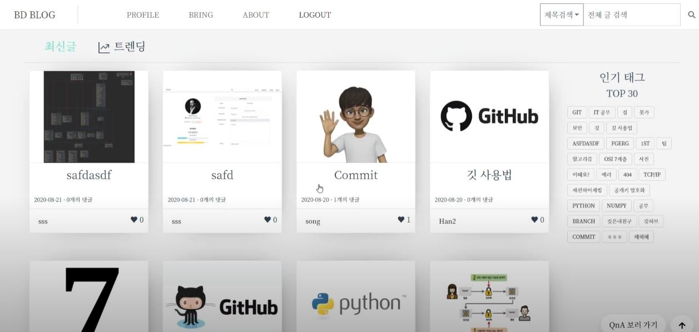
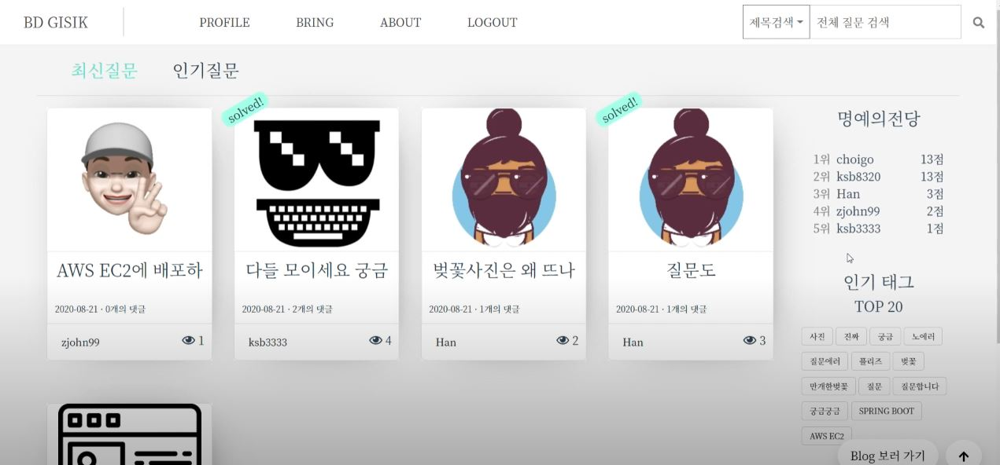
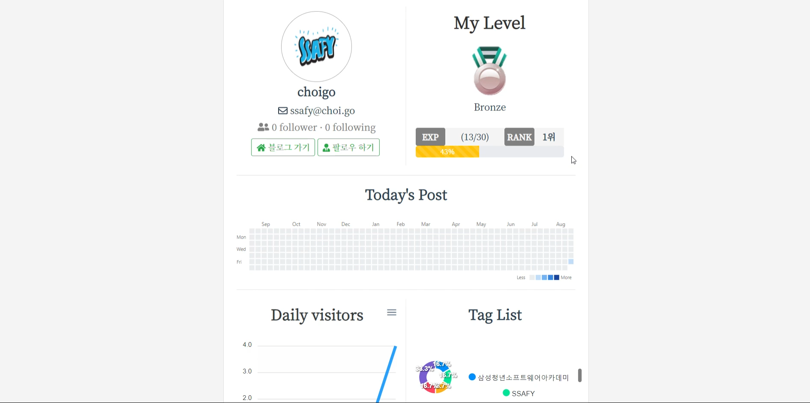
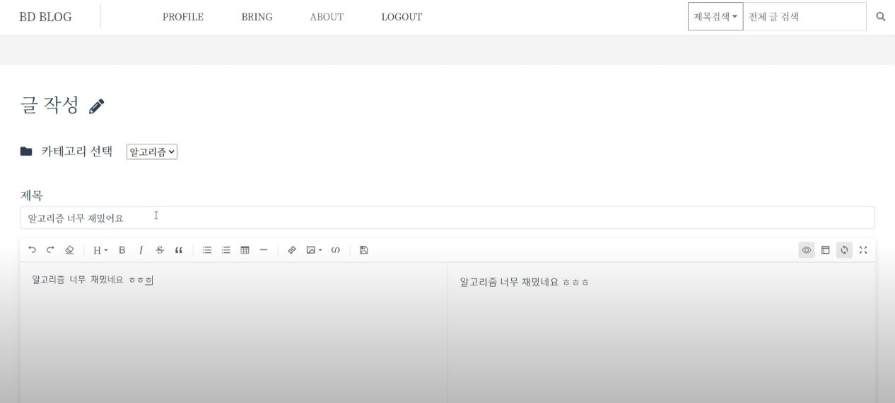
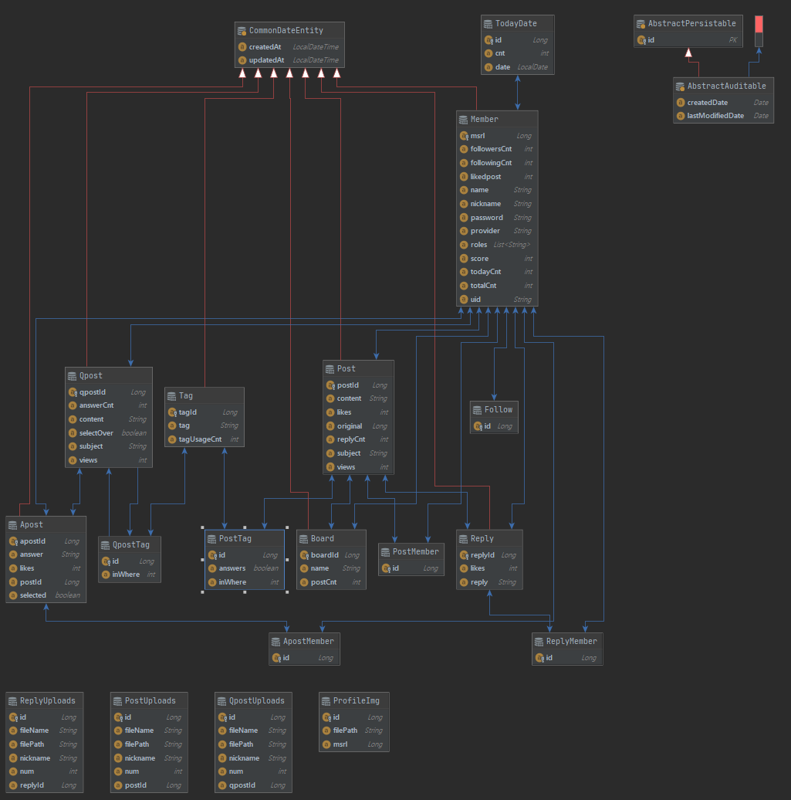

# Bring
> 팀원 : 송은석, 장주환, 권도현, 김수빈, 한정연
>
> 개발기간 : 20.07.13 ~ 20.08.21
>
> 시연영상 : https://youtu.be/YyN6cWgXAaw

## 배포(현재중단)

- http://i3c206.p.ssafy.io
- API Docs(Swagger): http://i3c206.p.ssay.io/api/swagger-ui.html

## 개요

개발자들을 위한 커뮤니티 서비스를 지향합니다.

개발자들이 각자의 지식을 정리하며 성장 할 수 있는 자신만의 블로그 기능과

스택오버플로우와 같이 질문을 올리고 답을 얻을 수 있는 기능을 합친 서비스를 개발하였습니다.

##  기술스택

- CI/CD: Nginx, GitLab CI/CD
- Server: AWS EC2, Docker
- Storage: AWS S3(CloudFront)
- DB: Mariadb(Docker), Reids(Docker), JPA
- Back-end Framework: Spring Boot
- Front-end: Vue js, axios
- Library: Spring Security, OAuth2.0(JWT)

## 주요 기능

- 회원가입 & 로그인
- 프로필 기능 : 회원 정보 수정 및 프로필 사진 등록, 팔로워 및 팔로잉 목록, 데일리 포스트 수 기반 잔디 Api, 일일 방문자 그래프, 태그 사용 목록 및 그래프
- 개인 블로그 기능 : 게시판 CRUD, 개인 포스트 CRUD, Q&A CRUD 및 답변 기록 공유
- 메인페이지: 블로그 포스트 최신글(14일 이내), 블로그 포스트 트렌드(인기글, 조회수 40이상 or 추천수 20개 이상, 14일 이내), Q&A 최신글(14일 이내), Q&A 트렌드(인기글, 조회수 40 이상 or 답변 수 1 이상,14일 이내), 태그 검색 기능 및 인기 태그 Top 30
- 헤더: 메뉴바, 검색창

##  ERD 다이어그램

